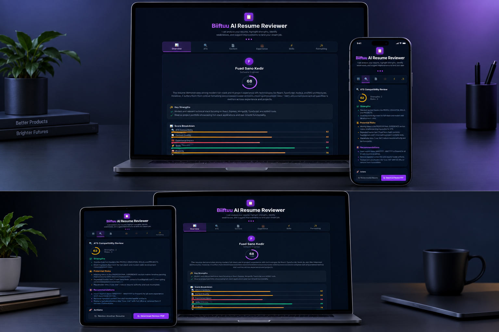

<p align="center">
  
</p>

<h1 align="center">Biiftuu — AI Resume Reviewer</h1>

<p align="center">
  <strong>Your AI-powered career companion.</strong><br/>
  Upload your resume and get an instant, evidence-based review — strengths highlighted, weaknesses flagged, and actionable improvements delivered.
</p>

<p align="center">
  <a href="#features">Features</a> •
  <a href="#tech-stack">Tech Stack</a> •
  <a href="#quick-start">Quick Start</a> •
  <a href="#api-docs">API Docs</a> •
  <a href="#deployment">Deployment</a> •
  <a href="#license">License</a>
</p>

---

## What Biiftuu Does

Biiftuu analyzes your resume across **6 critical dimensions** and delivers a comprehensive review with scores, priority fixes, and detailed feedback — all powered by Google Gemini AI.

---

## Features

| Category | What You Get |
|---|---|
| 🎯 **Score Overview** | Overall score with breakdowns by section |
| 🔍 **ATS Compatibility** | How well your resume passes Applicant Tracking Systems |
| 📄 **Content Review** | Summary, experience, and project quality analysis |
| 💼 **Experience Audit** | Bullet point scoring with rewrite suggestions |
| ⚡ **Skills Assessment** | Skills gap analysis and recommendation alignment |
| ✨ **Formatting Check** | Layout, consistency, and readability review |
| 🎯 **Job Match** | Tailored feedback for a specific target role |
| 🚨 **Priority Fixes** | Ranked list of the most impactful improvements |

---

## Tech Stack

<table>
  <tr>
    <td align="center" width="50%">
      <strong>Frontend</strong><br/>
      React 18 • Vite • Tailwind CSS
    </td>
    <td align="center" width="50%">
      <strong>Backend</strong><br/>
      Python 3.12 • FastAPI • Uvicorn
    </td>
  </tr>
  <tr>
    <td align="center">
      <strong>AI Engine</strong><br/>
      Google Gemini (gemini-3.6-flash)
    </td>
    <td align="center">
      <strong>File Parsing</strong><br/>
      PyPDF2 • python-docx • python-magic
    </td>
  </tr>
</table>

---

## Quick Start

### Prerequisites

- **Python 3.12+**
- **Node.js 18+**
- **Google Gemini API key** — [Get one here](https://aistudio.google.com/apikey)

### Backend

```bash
cd backend
python3 -m venv venv
source venv/bin/activate   # Windows: venv\Scripts\activate
pip install -r requirements.txt

# Create .env file
cat > .env << 'EOF'
APP_ENV=development
FRONTEND_URL=http://localhost:5173
GEMINI_API_KEY=your_gemini_api_key_here
GEMINI_MODEL=gemini-3.6-flash
MAX_FILE_SIZE_MB=10
EOF

# Start the server
uvicorn app.main:app --reload
```

### Frontend

```bash
cd frontend
yarn install
yarn dev
```

The app is now running at **http://localhost:5173** 🚀

---

## Project Structure

```
Biiftuu/
├── backend/
│   ├── app/
│   │   ├── api/routes/        # API endpoints
│   │   ├── core/              # Config & settings
│   │   ├── services/          # AI, parsing, review logic
│   │   ├── schemas/           # Pydantic models
│   │   └── prompts/           # Gemini prompt templates
│   ├── requirements.txt
│   └── runtime.txt
├── frontend/
│   ├── public/
│   │   └── favicon.svg        # Branding asset
│   ├── src/
│   │   ├── components/        # UI components
│   │   ├── hooks/             # React hooks
│   │   ├── pages/             # Page views
│   │   └── services/          # API client
│   ├── package.json
│   └── vite.config.js
└── README.md
```

---

## API Documentation

Once the backend is running:

| Docs | URL |
|---|---|
| **Swagger UI** | http://localhost:8000/docs |
| **ReDoc** | http://localhost:8000/redoc |

### Endpoints

| Method | Endpoint | Description |
|---|---|---|
| `GET` | `/api/health` | Health check |
| `POST` | `/api/resumes/upload` | Upload a resume (PDF/DOCX) |
| `GET` | `/api/resumes/{id}` | Get resume details |
| `DELETE` | `/api/resumes/{id}` | Delete a resume |
| `POST` | `/api/resumes/{id}/review` | Run AI review on a resume |

---

## Environment Variables

### Backend

| Variable | Default | Description |
|---|---|---|
| `APP_ENV` | `development` | App environment |
| `FRONTEND_URL` | `http://localhost:5173,https://your-domain.com` | Allowed CORS origins (comma-separated) |
| `GEMINI_API_KEY` | — | **Required.** Google Gemini API key |
| `GEMINI_MODEL` | `gemini-3.6-flash` | Gemini model to use |
| `MAX_FILE_SIZE_MB` | `10` | Max upload size |

### Frontend

| Variable | Description |
|---|---|
| `VITE_API_URL` | Backend API base URL |

---

## Deployment

### Frontend → Vercel

1. Push to GitHub
2. Import on [Vercel](https://vercel.com)
3. Set `VITE_API_URL` env var (or hardcode in `src/services/api.js`)

### Backend → Render

1. Create a new **Web Service** on [Render](https://render.com)
2. Root directory: `backend`
3. Build: `pip install -r requirements.txt`
4. Start: `uvicorn app.main:app --host 0.0.0.0 --port $PORT`
5. Add env var: `GEMINI_API_KEY`

---

## License

MIT © [Biiftuu](https://github.com/mroxygen2024)
